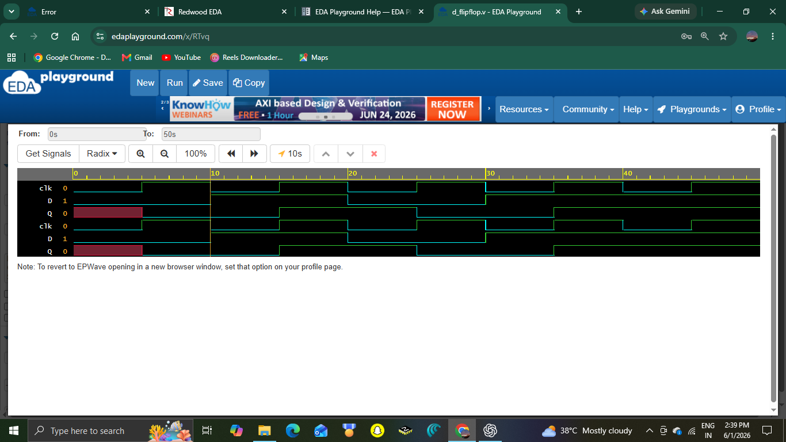
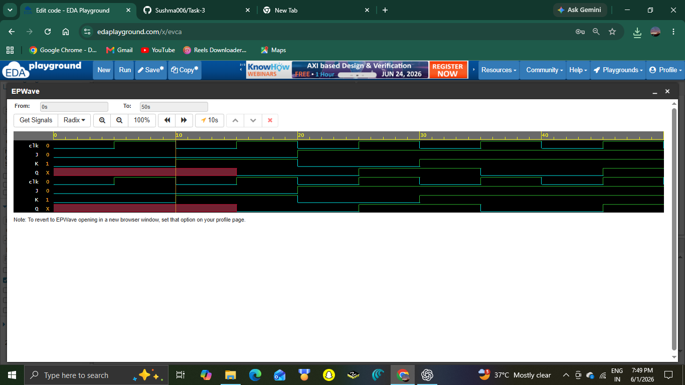
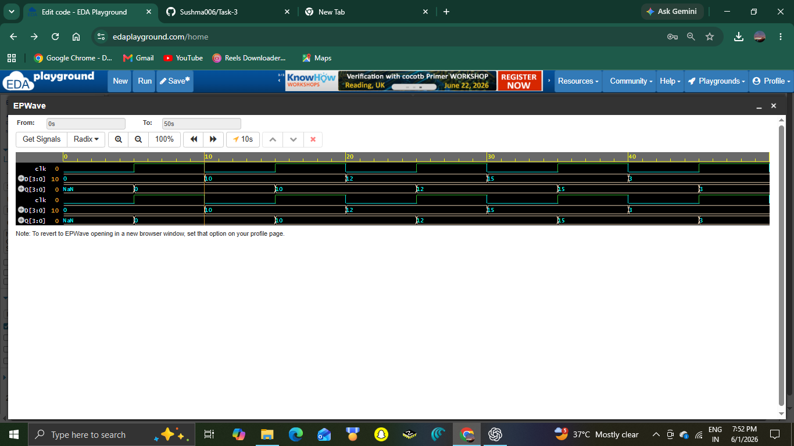
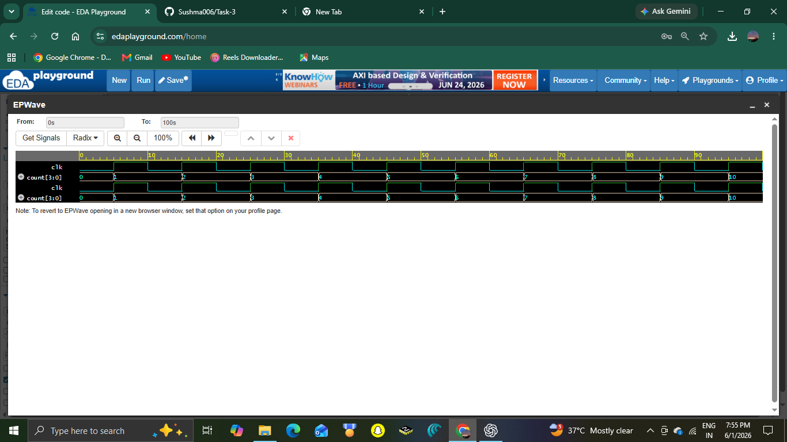

# VLSI Design Internship - Task 3
## Verilog RTL Design of Sequential Circuits and Flip-Flops

### Objective
The objective of this task is to understand sequential logic circuits and implement them using Verilog HDL. This task covers the design, simulation, and verification of flip-flops, registers, and counters using RTL coding and testbenches.

---

## Tools Used
- EDA Playground
- Verilog HDL
- Icarus Verilog Simulator
- EPWave Waveform Viewer
- GitHub

---

# 1. D Flip-Flop

## Description
A D Flip-Flop is a sequential circuit that stores one bit of data. The output Q takes the value of input D on the rising edge of the clock signal.

### Truth Table

| Clock Edge | D | Q(next) |
|------------|---|----------|
| Rising Edge | 0 | 0 |
| Rising Edge | 1 | 1 |

### Verilog Code
```verilog
module d_flipflop(
    input clk,
    input D,
    output reg Q
);

always @(posedge clk)
begin
    Q <= D;
end

endmodule
```

### Waveform


### Observation
The D Flip-Flop output changes only at the rising edge of the clock and stores the value present at input D.

---

# 2. JK Flip-Flop

## Description
A JK Flip-Flop is a sequential circuit with four operations: hold, reset, set, and toggle.

### Truth Table

| J | K | Q(next) |
|---|---|----------|
| 0 | 0 | No Change |
| 0 | 1 | Reset |
| 1 | 0 | Set |
| 1 | 1 | Toggle |

### Verilog Code
```verilog
module jk_flipflop(
    input clk,
    input J,
    input K,
    output reg Q
);

always @(posedge clk)
begin
    case ({J,K})
        2'b00: Q <= Q;
        2'b01: Q <= 0;
        2'b10: Q <= 1;
        2'b11: Q <= ~Q;
    endcase
end

endmodule
```

### Waveform


### Observation
The JK Flip-Flop successfully performed hold, reset, set, and toggle operations according to the input conditions.

---

# 3. 4-Bit Register

## Description
A 4-bit Register stores four bits of data and updates its output on the rising edge of the clock signal.

### Verilog Code
```verilog
module register4(
    input clk,
    input [3:0] D,
    output reg [3:0] Q
);

always @(posedge clk)
begin
    Q <= D;
end

endmodule
```

### Waveform


### Observation
The register correctly stored and transferred the 4-bit input data to the output at each clock edge.

---

# 4. 4-Bit Binary Counter

## Description
A 4-bit Binary Counter increments its value by one on every rising edge of the clock signal.

### Expected Count Sequence

| Clock Cycle | Count |
|------------|--------|
| 0 | 0000 |
| 1 | 0001 |
| 2 | 0010 |
| 3 | 0011 |
| 4 | 0100 |
| 5 | 0101 |
| 6 | 0110 |
| 7 | 0111 |

### Verilog Code
```verilog
module counter4(
    input clk,
    output reg [3:0] count
);

always @(posedge clk)
begin
    count <= count + 1;
end

initial begin
    count = 4'b0000;
end

endmodule
```

### Waveform


### Observation
The counter incremented its output value on every rising edge of the clock, demonstrating correct sequential counting behavior.

---

# Key Learning Outcomes

- Understanding sequential logic circuits
- Designing D and JK Flip-Flops
- Implementing registers and counters
- Writing Verilog RTL code
- Creating testbenches for verification
- Analyzing simulation waveforms
- Understanding clock-driven circuit behavior

---

# Conclusion

This project provided practical experience in designing and simulating sequential circuits using Verilog HDL. D Flip-Flops, JK Flip-Flops, a 4-bit Register, and a 4-bit Binary Counter were successfully implemented and verified through waveform analysis. The task improved understanding of RTL design, clock-based sequential logic, testbench development, and simulation techniques, which are fundamental concepts in VLSI design and digital system development.

